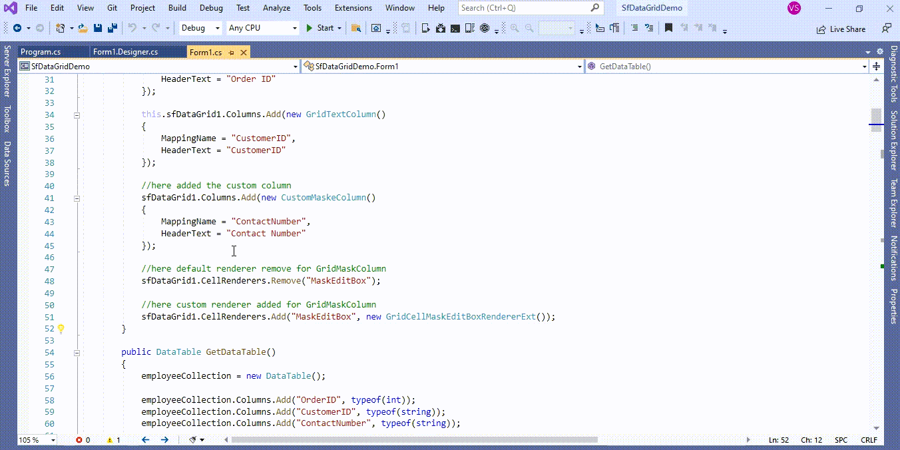

# How to set Mask value based on another cell value in GridMaskColumn of WinForms DataGrid (SfDataGrid)?

## About the sample
This example illustrates how to set Mask value based on another cell value in GridMaskColumn of [WinForms DataGrid](https://www.syncfusion.com/winforms-ui-controls/datagrid) (SfDataGrid)?

[WinForms DataGrid](https://www.syncfusion.com/winforms-ui-controls/datagrid) (SfDataGrid) does not provide the direct support to set Mask value based on another cell value in [GridMaskColumn](https://help.syncfusion.com/cr/windowsforms/Syncfusion.WinForms.DataGrid.GridMaskColumn.html). You can get set Mask value based on another cell value by overriding column and customize existing column renderer of [GridMaskColumn](https://help.syncfusion.com/cr/windowsforms/Syncfusion.WinForms.DataGrid.GridMaskColumn.html).

```C#

//here added the custom column
sfDataGrid1.Columns.Add(new CustomMaskeColumn()
{ 
                MappingName = "ContactNumber", 
                HeaderText = "Contact Number"               
});

//here default renderer remove for GridMaskColumn
sfDataGrid1.CellRenderers.Remove("MaskEditBox");

//here custom renderer added for GridMaskColumn
sfDataGrid1.CellRenderers.Add("MaskEditBox", new GridCellMaskEditBoxRendererExt());

```

```C#

//Create the custom column
public class CustomMaskeColumn : GridMaskColumn
{
        protected override object GetFormattedValue(object record, object value)
        {
            if (value == null)
                return value;

            var formattedValue = !string.IsNullOrEmpty(value.ToString()) ? MaskHelper.GetMaskedValue(record,value, this) : value;
            return formattedValue;
        }       
}

```

```C#

//MaskHelper for Custom type Mask based on Cell value
internal class MaskHelper
{       
        private static int maskIndex;
       
        private static readonly string defDigitSymbols = "9#";
        
        private static readonly string defOtherSymbols = "?&CAaXxy";
       
        private static readonly string defSeparatorSymbols = ".:/";
       
        private static readonly string defShiftSymbols = "<>";
        
        private static Dictionary<int, int> TextMaskIndexes = new Dictionary<int, int>();
        
        private static Dictionary<int, CharacterCasing> ShiftStatusIndexes = new Dictionary<int, CharacterCasing>();
       
        internal static object GetMaskedValue(object record,object value, GridMaskColumn gridMaskColumn)
        {
            string text = string.Empty, maskSymbol = string.Empty;
            maskIndex = -1;
            var shiftStatus = CharacterCasing.Normal;
            string cellValue = value.ToString();

            if (TextMaskIndexes != null && TextMaskIndexes.Count > 0)
                TextMaskIndexes.Clear();

            if (ShiftStatusIndexes != null && ShiftStatusIndexes.Count > 0)
                ShiftStatusIndexes.Clear();

            //get the CustomerID column cell value
            var recordCellValue = (record as DataRowView).Row["CustomerID"].ToString();
            //set the mask for ALFKI value 
            if (recordCellValue == "ALFKI")
            {
                //here set the mask type 
                gridMaskColumn.Mask = @"999\.999\.999\-99";
            }
            //set the mask for BERGS value 
            else if (recordCellValue == "BERGS")
            {
                //here set the mask type 
                gridMaskColumn.Mask = @"99\.999\.999\/9999\-99";
            }

            while (maskIndex < gridMaskColumn.Mask.Length - 1)
            {
                maskSymbol = GetNextMaskSymbol(true, gridMaskColumn.Mask);

                if (!string.IsNullOrEmpty(maskSymbol))
                {
                    if (IsSymbolLiteral(maskSymbol))
                    {
                        if (maskSymbol[0] == '\\' && maskSymbol.Length == 2)
                        {
                            text += maskSymbol[1].ToString();
                        }
                        else
                        {
                            text += maskSymbol;
                        }
                    }
                    else if (defSeparatorSymbols.Contains(maskSymbol))
                    {
                        text += GetSeparatorText(maskSymbol[0], gridMaskColumn);
                    }
                    else if (defShiftSymbols.Contains(maskSymbol))
                    {
                        shiftStatus = GetShiftStatus(maskSymbol);
                    }
                    else
                    {
                        if (TextMaskIndexes != null)
                            TextMaskIndexes.Add(text.Length, maskIndex);

                        if (ShiftStatusIndexes != null)
                            ShiftStatusIndexes.Add(text.Length, shiftStatus);

                        text += gridMaskColumn.PromptCharacter;
                    }
                }
            }

            var savedText = cellValue;
            maskIndex = -1;
            cellValue = string.IsNullOrEmpty(gridMaskColumn.Mask) ? savedText : text;

            if (!string.IsNullOrEmpty(gridMaskColumn.Mask))
            {
                var j = 0;
                for (var i = 0; i < cellValue.Length && j < savedText.Length; i++)
                {
                    if (TextMaskIndexes != null && TextMaskIndexes.ContainsKey(i))
                    {
                        if (IsAcceptableSymbol(gridMaskColumn.Mask[TextMaskIndexes[i]].ToString(), savedText[j], gridMaskColumn))
                        {
                            ReplaceTextSymbol(i, savedText[j++].ToString(), ref cellValue);
                        }
                    }
                    else
                    {
                        if (cellValue[i] == savedText[j])
                        {
                            ReplaceTextSymbol(i, savedText[j++].ToString(), ref cellValue);
                        }
                    }
                }

                return cellValue;
            }

            return value;
        }
       
        private static CharacterCasing GetShiftStatus(string maskSymbol)
        {
            switch (maskSymbol)
            {
                case ">":
                    return CharacterCasing.Upper;
                case "<":
                    return CharacterCasing.Lower;
                default:
                    return CharacterCasing.Normal;
            }
        }
       
        private static bool IsAcceptableSymbol(string maskSymbol, char input, GridMaskColumn gridMaskColumn)
        {
            switch (maskSymbol)
            {
                case "9":
                    return (char.IsDigit(input)) && input != '\t';

                case "#":
                    return (char.IsDigit(input) || char.IsWhiteSpace(input) || input == '+' || input == '-') && input != '\t';

                case "?":
                case "y":
                    return (char.IsLetter(input) || char.IsWhiteSpace(input)) && input != '\t';

                case "&":
                case "C":
                    return input != '\t';

                case "a":
                case "A":

                    return char.IsLetterOrDigit(input);

                case "X":
                case "x":
                    if ((input >= 'a' && input <= 'f')
                                  || (input >= 'A' && input <= 'F')
                                  || (input >= '0' && input <= '9')
                                  )
                        return true;
                    else
                        return false;

                    break;
            }

            return false;
        }
       
        private static void ReplaceTextSymbol(int index, string symbol, ref string value)
        {
            if (index > -1 && index < value.Length)
            {
                if (ShiftStatusIndexes.ContainsKey(index))
                {
                    switch (ShiftStatusIndexes[index])
                    {
                        case CharacterCasing.Upper:
                            symbol = symbol.ToUpper();
                            break;
                        case CharacterCasing.Lower:
                            symbol = symbol.ToLower();
                            break;
                    }
                }

                var text = value.Remove(index, 1);
                value = text.Insert(index, symbol);
            }
        }
        
        private static char GetSeparatorText(char symbol, GridMaskColumn gridMaskColumn)
        {
            switch (symbol)
            {
                case '.':
                    return gridMaskColumn.DecimalSeparator;
                case ':':
                    return gridMaskColumn.TimeSeparator;
                case '/':
                    return gridMaskColumn.DateSeparator;
            }

            return ' ';
        }
        
        private static bool IsSymbolLiteral(string maskSymbol)
        {
            if (defSeparatorSymbols.Contains(maskSymbol) ||
                defShiftSymbols.Contains(maskSymbol) || (defDigitSymbols.Contains(maskSymbol) || defOtherSymbols.Contains(maskSymbol)))
            {
                return false;
            }
            else
            {
                return true;
            }
        }
        
        private static string GetNextMaskSymbol(bool bMoveCursor, string mask)
        {
            var res = string.Empty;
            if (maskIndex < mask.Length - 1)
            {
                res = mask[bMoveCursor ? ++maskIndex : maskIndex + 1].ToString();
                if (res == @"\" && maskIndex < mask.Length - 1)
                {
                    res += mask[bMoveCursor ? ++maskIndex : maskIndex + 2];
                }
            }

            return res;
        }
}

```

```C#

//set mask for while editing in SfDataGrid
public class GridCellMaskEditBoxRendererExt : GridCellMaskEditBoxRenderer
{        
        protected override void OnInitializeEditElement(DataColumnBase column, RowColumnIndex rowColumnIndex, MaskedEditBox uiElement)
        {
            var dataGrid = column.Renderer.TableControl.GetType().GetProperty("DataGrid", BindingFlags.Instance | BindingFlags.NonPublic).GetValue(column.Renderer.TableControl) as SfDataGrid;
            var style = new CellStyleInfo();
            string val = GetCellValue();
            var maskTextBoxColumn = column.GridColumn as GridMaskColumn;
            style.ModifyStyle(dataGrid.Style.CellStyle.Store, StyleModifyType.Override);
            style.ModifyStyle(column.GridColumn.CellStyle.Store, StyleModifyType.Override);
            Rectangle bounds = this.GetEditorUIElementBounds();

            uiElement.DecimalSeparator = maskTextBoxColumn.DecimalSeparator;
            uiElement.TimeSeparator = maskTextBoxColumn.TimeSeparator;
            uiElement.DateSeparator = maskTextBoxColumn.DateSeparator;
            uiElement.ClipMode = maskTextBoxColumn.MaskFormat;
            uiElement.PromptCharacter = maskTextBoxColumn.PromptCharacter;
           //get the RowData
            var dataRow = column.GetType().GetProperty("DataRow", BindingFlags.Instance | BindingFlags.NonPublic).GetValue(column) as DataRowBase;
            //get the CustomerID column value
            var record = (dataRow.RowData as DataRowView).Row["CustomerID"].ToString();
            //set the mask for ALFKI value 
            if (record == "ALFKI")
            {
                //if you change the value in cell please set mask like below
                uiElement.Mask = @"999\.999\.999\-99";
            }
            //set the mask for BERGS value 
            else if (record == "BERGS")
            {
                //if you change the value in cell please set mask like below
                uiElement.Mask = @"99\.999\.999\/9999\-99";
            }               
            
            uiElement.Text = val ?? string.Empty;
            var previewInputText = dataGrid.CurrentCell.CellRenderer.GetType().GetProperty("PreviewInputText", BindingFlags.Instance | BindingFlags.NonPublic);
            uiElement.Text = previewInputText.GetValue(dataGrid.CurrentCell.CellRenderer) as string ?? uiElement.Text;
            uiElement.AutoSize = false;
            uiElement.Location = bounds.Location;
            uiElement.Size = bounds.Size;
            uiElement.RightToLeft = dataGrid.RightToLeft;
            uiElement.BorderStyle = BorderStyle.None;
            uiElement.TextAlign = style.HorizontalAlignment;
            uiElement.Font = style.GetFont();
            uiElement.BackColor = dataGrid.Style.CurrentCellStyle.BackColor;
            uiElement.ForeColor = dataGrid.Style.CurrentCellStyle.TextColor;
            dataGrid.GetTopLevelParentDataGrid().TableControl.Controls.Add(uiElement);
            var hasEditingControl = dataGrid.CurrentCell.CellRenderer.GetType().GetProperty("HasEditingControl", BindingFlags.Instance | BindingFlags.NonPublic);
            hasEditingControl.SetValue(dataGrid.CurrentCell.CellRenderer, true); 
            uiElement.Focus();

            if (previewInputText.GetValue(dataGrid.CurrentCell.CellRenderer) as string == null)
            {                
                switch (dataGrid.EditorSelectionBehavior)
                {
                    case EditorSelectionBehavior.Default:
                        var mousePos = uiElement.PointToClient(Cursor.Position);
                        var charIndex = uiElement.GetCharIndexFromPosition(mousePos);
                        var charPosition = uiElement.GetPositionFromCharIndex(charIndex);
                        if (mousePos.X > charPosition.X)
                            charIndex++;
                        else if (mousePos.Y < 0)
                            charIndex = 0;
                        uiElement.Select(charIndex, 0);
                        break;

                    case EditorSelectionBehavior.SelectAll:
                        uiElement.SelectAll();
                        break;
                    case EditorSelectionBehavior.MoveLast:
                        uiElement.SelectionStart = uiElement.Text.ToString().Length;
                        uiElement.SelectionLength = 0;
                        break;
                }
            }
            else
            {
                uiElement.SelectionStart = uiElement.Text.Length;
                uiElement.SelectionLength = 0;
                previewInputText.SetValue(dataGrid.CurrentCell.CellRenderer, null);                
            }
        }
}

```



Take a moment to peruse the [WinForms DataGrid - Custom Column](https://help.syncfusion.com/windowsforms/datagrid/columntypes#custom-column-support) documentation, where you can find about custom column with code examples.

## Requirements to run the demo
Visual Studio 2015 and above versions
